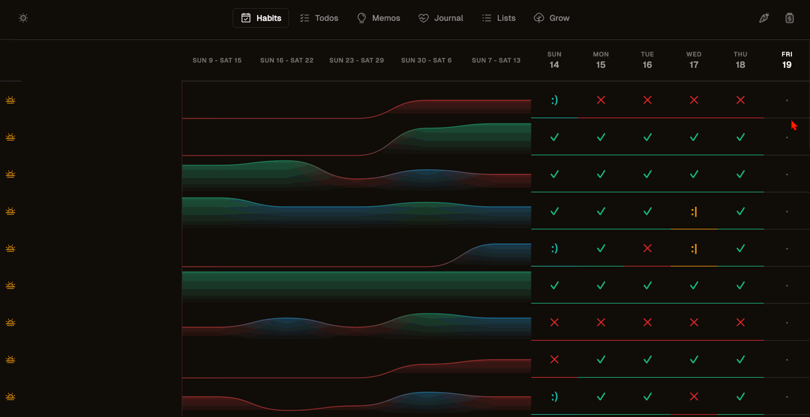

# 🌳 Strong Roots 

Strong Roots is my command center for habits, daily todos, notes, journals, lists, and goals. I use this as the "open" tab on my personal computer. It also makes it easy to access my calendar, my budgetting app, Linear, and Perplexity. It also allows me to record weekly vlogs using the Loom SDK recorder.

This tool exists to help me bias my time towards action & expression rather than planinng and selecting "what to do". The ultimate goal of this app is to make **me** more organized, productive, and happy. I hope you find it useful too! Running `~/strongroots/go.sh` will handle setup from a cold boot and launch the app. 

## Features

### 📊 **Habits**
Track your daily habits with convenient rollup metrics.



- **Daily tracking** with visual calendar view
- **Sunday Reflection**: Record an end-of-week video reflection using the built-in **Loom SDK recorder**
- **Flexible scheduling**: morning, night, exercise, health, weekdays, etc with icon differentiation
- **Weekly rollups** showing your consistency at a glance
- **Collapsible week views** to zoom out and see progress over time
- **State tracking**: ✅ Done, ❌ Failed, `:)` Failed with exception, or `:/` Succeeded Poorly

### ✅ **Todos**
Daily task management separated by **Life** and **Work**. Inspired by [Tweek](https://tweek.so/).

- **Single-day focus** - see only today's tasks
- **Easy task punting** - move incomplete tasks to the next day
- **State tracking**: Active, Completed, or Failed
- **Quick add** - type and hit enter to create tasks
- **Smart sorting** - unfinished tasks always appear first

### 💭 **Memos**
Integrated [Memos](https://github.com/usememos/memos) iframe for quick thoughts and notes.

- **Runs locally** alongside the app
- **Lightweight note-taking** without leaving your workflow
- **Privacy-first** - all data stays on your machine

### 📔 **Journal**
Daily check-ins with thoughtful prompts worth asking every day.

- **Configurable questions** like:
  - "What went well today?"
  - "What did you eat today?"

- **Ad-hoc questions** - add day-specific prompts
- **Full-width cards** for comfortable writing

### 📝 **Lists**
Organize ideas and groups of thoughts that belong together. Looks like Todoist Kanban view.

- **Perfect for**:
  - Groceries
  - Furniture ideas
  - Movie watchlists
- **Checkbox items** to track completion
- **Quick add/edit** - inline editing for speed

### 🌱 **Grow**
Google Keep-style cards for ideas on what to do next.

- **Visual card layout** with different sizes (small, medium, large, tall, wide)
- **Start/Archive** - move cards when you begin or complete them

## Getting Started

### Prerequisites
- Node.js (v16+)
- pnpm

### Installation

1. **Clone the repository**
   ```bash
   git clone <your-repo-url>
   cd habits
   ```

2. **Install dependencies**
   ```bash
   # Install server dependencies
   cd server
   npm install
   cd ..

   # Install client dependencies
   cd client
   pnpm install
   cd ..
   ```

3. **Start the app**
   ```bash
   ./go.sh
   ```

   This will:
   - Initialize any missing data files
   - Start the API server on `http://localhost:3000`
   - Start the client on `http://localhost:5174`
   - Open your browser automatically

## Project Structure

```
habits/
├── client/              # React frontend
│   ├── src/
│   │   ├── components/  # UI components (Habits, Todos, Diary, etc.)
│   │   ├── types.ts     # TypeScript interfaces
│   │   └── App.tsx      # Main app with navigation
│   └── package.json
├── server/              # Express API
│   ├── index.js         # API endpoints
│   └── package.json
├── data/                # Local data storage (gitignored)
│   ├── habits.csv       # Habit configurations
│   ├── entries.csv      # Habit entry records
│   ├── tasks.json       # Daily tasks
│   ├── diary.json       # Journal entries
│   ├── questions.csv    # Journal questions
│   ├── next.json        # Next ideas cards
│   ├── lists.json       # List data
│   └── vlogs.csv        # Video reflections
├── scripts/
│   └── init-data.sh     # Data initialization script
├── go.sh                # Startup script
└── README.md
```

## Tech Stack

- **Web Client**: React + TypeScript + Vite
- **API Server**: Node.js + Express
- **Storage**: CockroachDB
- **Styling**: Bad CSS written with Gemini (i am not this bad at css) with Phosphor Icons
- **Video**: Loom SDK


## Data Storage

Data is stored in **CockroachDB**.
Their free tier is very generous and should be more than enough for personal use.
They do require a CC but with price limiting, and 15$ of free credits every month, this works very well for this project.
Thank you Venture Capitalist who is paying for me to improve myself. I will eat you.

You must create a `.env` file in the `server` root with the following variables:

```bash
PORT=3000
DATABASE_URL=postgresql://.......
``` 

## Backups

TODO!

## Development

### Running the app
```bash
./go.sh
```

### Server only
```bash
cd server
node index.js
```

### Client only
```bash
cd client
pnpm run dev
```

### Building for production
```bash
cd client
pnpm run build
```

## API Endpoints

### Habits
- `GET /habits` - Get all active habits
- `GET /habit-entries?from=YYYY-MM-DD&to=YYYY-MM-DD` - Get entries in date range
- `POST /habit-entry` - Create/update a habit entry

### Tasks
- `GET /tasks` - Get all tasks
- `POST /tasks` - Save all tasks

### Diary
- `GET /questions` - Get all active questions
- `POST /questions` - Add a new question
- `GET /diary` - Get all diary entries
- `POST /diary` - Save diary entries

### Next
- `GET /next` - Get all active next items
- `POST /next` - Create a new next item
- `PATCH /next/:id` - Update a next item

### Lists
- `GET /lists` - Get all lists
- `POST /lists` - Create a new list
- `PATCH /lists/:id` - Update a list
- `DELETE /lists/:id` - Delete a list

### Vlogs
- `GET /vlogs/:weekStartDate` - Get vlog for a specific week
- `POST /vlogs` - Save a vlog

## Design

**Strong Roots** is built around a few core principles:

1. **Single source of truth** - One app for all your personal organization
2. **Local-first** - Your data stays on your machine
3. **Minimal friction** - Quick to open, quick to use
4. **Visual clarity** - Clean design with meaningful colors and icons
5. **Daily focus** - Emphasizes today while tracking long-term progress
6. **Reflection-driven** - Built-in prompts to help you learn and grow

## Privacy

All data is stored locally on your machine. Nothing is sent to external servers. Your habits, tasks, and reflections are yours alone.

## Acknowledgments

- [Memos](https://github.com/usememos/memos) - For the embedded note-taking experience
- [Phosphor Icons](https://phosphoricons.com/) - For beautiful, consistent icons
- [Loom SDK](https://www.loom.com/sdk) - For seamless video recording