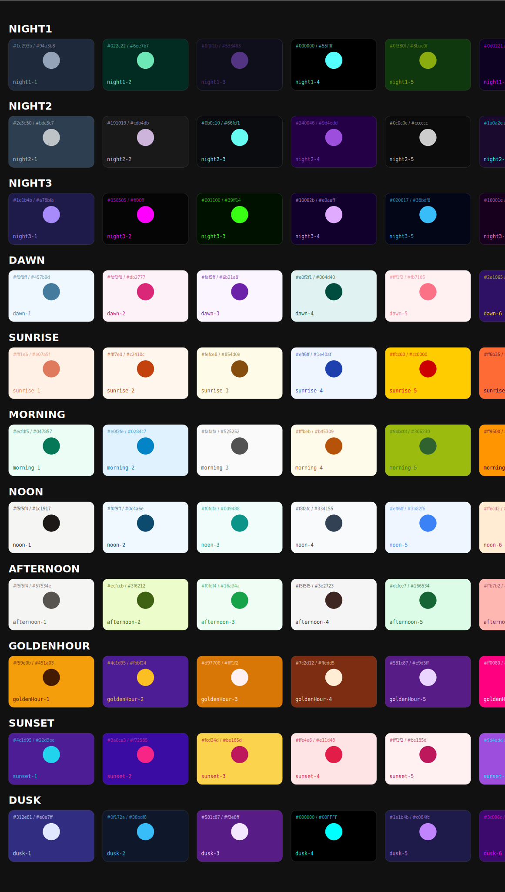

# Daylight Custom Themes

This document showcases the available color themes for the Daylight component.

**To regenerate this preview after updating themes, run:**
```bash
npm run generate:themes
```



## Theme List

### night1
- **night1-1**: `#1e293b` (bg) / `#94a3b8` (text)
- **night1-2**: `#022c22` (bg) / `#6ee7b7` (text)
- **night1-3**: `#0f0f1b` (bg) / `#533483` (text)
- **night1-4**: `#000000` (bg) / `#55ffff` (text)
- **night1-5**: `#0f380f` (bg) / `#8bac0f` (text)
- **night1-6**: `#0d0221` (bg) / `#ff00ff` (text)
- **night1-7**: `#0a0a0f` (bg) / `#ff6b6b` (text)
- **night1-8**: `#1a1a2e` (bg) / `#c9b1ff` (text)
- **night1-9**: `#0f0028` (bg) / `#ff1493` (text)
- **night1-10**: `#1c2833` (bg) / `#f4d03f` (text)

### night2
- **night2-1**: `#2c3e50` (bg) / `#bdc3c7` (text)
- **night2-2**: `#191919` (bg) / `#cdb4db` (text)
- **night2-3**: `#0b0c10` (bg) / `#66fcf1` (text)
- **night2-4**: `#240046` (bg) / `#9d4edd` (text)
- **night2-5**: `#0c0c0c` (bg) / `#cccccc` (text)
- **night2-6**: `#1a0a2e` (bg) / `#00ffff` (text)
- **night2-7**: `#0d1117` (bg) / `#58a6ff` (text)
- **night2-8**: `#2d2d44` (bg) / `#a8dadc` (text)
- **night2-9**: `#1a0036` (bg) / `#00ced1` (text)
- **night2-10**: `#2c3e50` (bg) / `#e74c3c` (text)

### night3
- **night3-1**: `#1e1b4b` (bg) / `#a78bfa` (text)
- **night3-2**: `#050505` (bg) / `#ff00ff` (text)
- **night3-3**: `#001100` (bg) / `#39ff14` (text)
- **night3-4**: `#10002b` (bg) / `#e0aaff` (text)
- **night3-5**: `#020617` (bg) / `#38bdf8` (text)
- **night3-6**: `#16001e` (bg) / `#ff6ec7` (text)
- **night3-7**: `#0b0b12` (bg) / `#f78166` (text)
- **night3-8**: `#1e3a5f` (bg) / `#ffd6ba` (text)
- **night3-9**: `#120024` (bg) / `#f39c12` (text)
- **night3-10**: `#17202a` (bg) / `#85c1e9` (text)

### dawn
- **dawn-1**: `#f0f8ff` (bg) / `#457b9d` (text)
- **dawn-2**: `#fdf2f8` (bg) / `#db2777` (text)
- **dawn-3**: `#faf5ff` (bg) / `#6b21a8` (text)
- **dawn-4**: `#e0f2f1` (bg) / `#004d40` (text)
- **dawn-5**: `#fff1f2` (bg) / `#fb7185` (text)
- **dawn-6**: `#2e1065` (bg) / `#ffd700` (text)
- **dawn-7**: `#1a1a25` (bg) / `#79c0ff` (text)
- **dawn-8**: `#e8d6cf` (bg) / `#7b2d26` (text)
- **dawn-9**: `#3d1a50` (bg) / `#ffd700` (text)
- **dawn-10**: `#fad6a5` (bg) / `#8b4513` (text)

### sunrise
- **sunrise-1**: `#fff1e6` (bg) / `#e07a5f` (text)
- **sunrise-2**: `#fff7ed` (bg) / `#c2410c` (text)
- **sunrise-3**: `#fefce8` (bg) / `#854d0e` (text)
- **sunrise-4**: `#eff6ff` (bg) / `#1e40af` (text)
- **sunrise-5**: `#ffcc00` (bg) / `#cc0000` (text)
- **sunrise-6**: `#ff6b35` (bg) / `#1a0533` (text)
- **sunrise-7**: `#2d2d3d` (bg) / `#ffa657` (text)
- **sunrise-8**: `#ffeaa7` (bg) / `#d35400` (text)
- **sunrise-9**: `#ff4500` (bg) / `#ffffff` (text)
- **sunrise-10**: `#f8b500` (bg) / `#a52a2a` (text)

### morning
- **morning-1**: `#ecfdf5` (bg) / `#047857` (text)
- **morning-2**: `#e0f2fe` (bg) / `#0284c7` (text)
- **morning-3**: `#fafafa` (bg) / `#525252` (text)
- **morning-4**: `#fffbeb` (bg) / `#b45309` (text)
- **morning-5**: `#9bbc0f` (bg) / `#306230` (text)
- **morning-6**: `#ff9500` (bg) / `#2a0845` (text)
- **morning-7**: `#3d3d4d` (bg) / `#adbac7` (text)
- **morning-8**: `#dfe6e9` (bg) / `#2d3436` (text)
- **morning-9**: `#ff6b35` (bg) / `#0d0019` (text)
- **morning-10**: `#fef3c7` (bg) / `#d35400` (text)

### noon
- **noon-1**: `#f5f5f4` (bg) / `#1c1917` (text)
- **noon-2**: `#f0f9ff` (bg) / `#0c4a6e` (text)
- **noon-3**: `#f0fdfa` (bg) / `#0d9488` (text)
- **noon-4**: `#f8fafc` (bg) / `#334155` (text)
- **noon-5**: `#eff6ff` (bg) / `#3b82f6` (text)
- **noon-6**: `#ffecd2` (bg) / `#be3455` (text)
- **noon-7**: `#4d4d5d` (bg) / `#f0f6fc` (text)
- **noon-8**: `#f5f6fa` (bg) / `#353b48` (text)
- **noon-9**: `#ff8c42` (bg) / `#1a0033` (text)
- **noon-10**: `#fff9e6` (bg) / `#5d4037` (text)

### afternoon
- **afternoon-1**: `#f5f5f4` (bg) / `#57534e` (text)
- **afternoon-2**: `#ecfccb` (bg) / `#3f6212` (text)
- **afternoon-3**: `#f0fdf4` (bg) / `#16a34a` (text)
- **afternoon-4**: `#f5f5f5` (bg) / `#3e2723` (text)
- **afternoon-5**: `#dcfce7` (bg) / `#166534` (text)
- **afternoon-6**: `#ffb7b2` (bg) / `#6b2d5c` (text)
- **afternoon-7**: `#3a3a4a` (bg) / `#d4a373` (text)
- **afternoon-8**: `#ffefd5` (bg) / `#6b4423` (text)
- **afternoon-9**: `#e85d04` (bg) / `#15002b` (text)
- **afternoon-10**: `#e6d3b3` (bg) / `#6d4c41` (text)

### goldenHour
- **goldenHour-1**: `#f59e0b` (bg) / `#451a03` (text)
- **goldenHour-2**: `#4c1d95` (bg) / `#fbbf24` (text)
- **goldenHour-3**: `#d97706` (bg) / `#fff1f2` (text)
- **goldenHour-4**: `#7c2d12` (bg) / `#ffedd5` (text)
- **goldenHour-5**: `#581c87` (bg) / `#e9d5ff` (text)
- **goldenHour-6**: `#ff0080` (bg) / `#ffffff` (text)
- **goldenHour-7**: `#2a1f3d` (bg) / `#f72585` (text)
- **goldenHour-8**: `#fab1a0` (bg) / `#6c3461` (text)
- **goldenHour-9**: `#d00070` (bg) / `#8a185bff` (text)
- **goldenHour-10**: `#f4a261` (bg) / `#264653` (text)

### sunset
- **sunset-1**: `#4c1d95` (bg) / `#22d3ee` (text)
- **sunset-2**: `#3a0ca3` (bg) / `#f72585` (text)
- **sunset-3**: `#fcd34d` (bg) / `#be185d` (text)
- **sunset-4**: `#ffe4e6` (bg) / `#e11d48` (text)
- **sunset-5**: `#fff1f2` (bg) / `#be185d` (text)
- **sunset-6**: `#9d4edd` (bg) / `#00ffff` (text)
- **sunset-7**: `#1a0a24` (bg) / `#7209b7` (text)
- **sunset-8**: `#fdcb6e` (bg) / `#6c5ce7` (text)
- **sunset-9**: `#7b2cbf` (bg) / `#580550ff` (text)
- **sunset-10**: `#e76f51` (bg) / `#f6e5b8` (text)

### dusk
- **dusk-1**: `#312e81` (bg) / `#e0e7ff` (text)
- **dusk-2**: `#0f172a` (bg) / `#38bdf8` (text)
- **dusk-3**: `#581c87` (bg) / `#f3e8ff` (text)
- **dusk-4**: `#000000` (bg) / `#00FFFF` (text)
- **dusk-5**: `#1e1b4b` (bg) / `#c084fc` (text)
- **dusk-6**: `#3c096c` (bg) / `#ff00ff` (text)
- **dusk-7**: `#0d0d17` (bg) / `#4cc9f0` (text)
- **dusk-8**: `#6c5ce7` (bg) / `#ffeaa7` (text)
- **dusk-9**: `#2d0068` (bg) / `#ff00ff` (text)
- **dusk-10**: `#264653` (bg) / `#e9c46a` (text)
